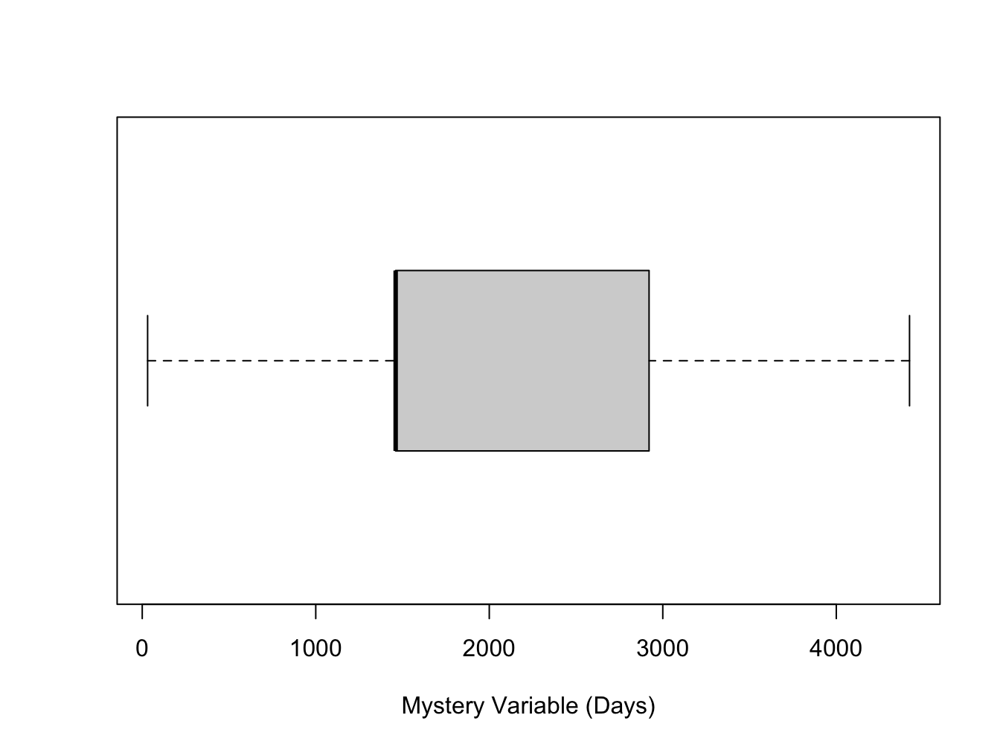

--- 
title: "STAT0002 Introduction to Probability and Statistics Weekly Exercises"
author: "Ge Li (Sunny)"
date: "November 3 2023"
output: bookdown::gitbook
site: bookdown::bookdown_site
documentclass: book
bibliography: [book.bib, packages.bib]
# url: your book url like https://bookdown.org/yihui/bookdown
# cover-image: path to the social sharing image like images/cover.jpg
description: |
  This is my documentation of my assignments and exercises of STAT0002.
github-repo: sunnyhh/stat0002
link-citations: yes
always_allow_html: yes
---
# Preface {.unnumbered}
This document is used to document my assignments and weekly exercises of STAT0002.

<!--chapter:end:index.Rmd-->

# Exercise 1

## Question 1
**Import a set of data "days" from STAT0002 library. Calculate the five-number summary of these data.**
```{r}
library(stat0002)
# To give us a better understanding of the data imported:
sort(days)
fivenum(days)
```
Therefore, the five-number summary of the dataset is (31, 1460, 1460.5, 2921, 4422) days.

## Question 2
**Create a boxplot of these data.**


Combining the shape of this boxplot and the data summary we acquired above, the shape of the distribution of this dataset is slightly positively skewed. There are no outliers. All the data values are concluded in the boxplot. The boxplot visualizes the five-number summary as well as the location, shape, and spread of the distribution.

## Question 3
**Create histograms of these data with with different breaks.**


While the first histogram shows us a rough shape and distribution, the second histogram is more detailed with more breaks. We can easily identify the modes of distribution using histograms and acquire a basic shape of the distribution as well.

## Question 4
**Create a stem-and-leaf plot of the data.**
```{r}
stem(days)
```
We could conclude from this plot that the shape of this dataset follows a bimodal distribution, where a lot of values in the data fall around 1500 and 2900.

## Question 5
**Create a dot plot of the data.**


The dot plot confirms our conclusion from the stem-and-leaf plot stated above.

## Question 6
**Find if there are any outliers in this dataset.**
```{r}
IQR <- IQR(days)
UpperBound <- 2921 + 1.5 * IQR
LowerBound <- 1460 - 1.5 * IQR
UpperBound
LowerBound
```
All the values from the data fall in the range $\in [-710.125, 5091.125]$. Therefore, there aren’t any outliers. Since 2922 days are approximately equivalent to 8 years, these data might represent the time it takes for people to get a Ph.D., the 8-year cycle of Venus, or the length of the presidency of the United States.

<!--chapter:end:01-Exercise-1.Rmd-->

# Exercise 2

## Question 1 - Location
**(a) Sample Mean**
$$\begin{aligned}
\bar{x} &= \frac{1}{n} \sum_{i=1}^{n} x_i \\
\bar{y} & =\frac{1}{n} \sum_{i=1}^{n} y_i \\
         &=\frac{1}{n} \sum_{i=1}^{n} (ax_i + b) \\
         &=\frac{1}{n}(a\frac{1}{n} \sum_{i=1}^{n} x_i + bn) \\
         &=\frac{a}{n} \sum_{i=1}^{n} x_i + b \\
\therefore \bar{y} &= a\bar{x} + b
\end{aligned}$$

**(b) Sample Median: ** The order of the values in the dataset sorted will remain the same after the transformation. As a result, $y_{1/2} = ax_{1/2} + b$. \
**(c) Summary: ** The above results about sample mean and sample median are reasonable based on mathematical proof.

## Question 2 - Spread
**(a) Standard Deviation**
$$\begin{aligned}
S_x &= \sqrt{\frac{1}{n-1} \sum_{i=1}^{n} (x_i - \bar{x})^2} \\
S_y &= \sqrt{\frac{1}{n-1} \sum_{i=1}^{n} (y_i - \bar{y})^2} \\
S_y &= \sqrt{\frac{1}{n-1} \sum_{i=1}^{n} (ax_i + b - (a\bar{x} + b))^2} \\
    &= \sqrt{\frac{a^2}{n-1} \sum_{i=1}^{n} (x_i - \bar{x})^2} \\
    &= a \sqrt{\frac{1}{n-1} \sum_{i=1}^{n} (x_i - \bar{x})^2} \\
\therefore S_y &= a S_x 
\end{aligned}$$

**(b) Sample Interquartile Range**
$$\begin{aligned} 
q_U^x - q_L^x &= x_{\frac{3}{4}(n+1)} - x_{\frac{1}{4}(n+1)} \\
q_U^y - q_L^y &= y_{\frac{3}{4}(n+1)} - y_{\frac{1}{4}(n+1)} \\
q_U^y - q_L^y &= ax_{\frac{3}{4}(n+1)} + b - (ax_{\frac{1}{4}(n+1)} + b) \\
q_U^y - q_L^y &= a(x_{\frac{3}{4}(n+1)} - x_{\frac{1}{4}(n+1)}) \\
\therefore q_U^y - q_L^y &= a(q_U^x - q_L^x)
\end{aligned}$$

**(c) Summary: ** The above results about sample interquartile range and standard deviation make sense based on mathematical proof.

## Question 3 - Shape
**(a) Standardized Sample Skewnewss**
$$\require{cancel}
\begin{aligned} 
Skewness_x &= \frac{1}{n} \cdot \frac{\sum_{i=1}^{n} (x_i - \bar{x})^3}{S_x^3} \\
Skewness_y &= \frac{1}{n} \cdot \frac{\sum_{i=1}^{n} (y_i - \bar{y})^3}{S_y^3} \\
Skewness_y &= \frac{1}{n} \cdot \frac{\cancel{a^3} \cdot \sum_{i=1}^{n} (x_i - \bar{x})^3}{\cancel{a^3} \cdot S_x^3} \\
\therefore Skewness_y &= Skewness_x
\end{aligned}$$
**(b) Sample Quartile Skewness**
$$\require{cancel}
\begin{aligned}
Skewness_x &= \frac{(q_U^x - m_x) - (m_x - q_L^x)}{q_U^x - q_L^x} \\
Skewness_y &= \frac{(q_U^y - m_y) - (m_y - q_L^y)}{q_U^y - q_L^y} \\
Skewness_y &= \frac{\cancel{a}((q_U^x - m_x) - (m_x - q_L^x))}{\cancel{a}(q_U^x - q_L^x)} \\
\therefore Skewness_y &= Skewness_x
\end{aligned}$$
**(c) Summary: ** The above results about standardized sample skewness and sample quartile skewness are correct based on mathematical proof.


## Question 4 - About Sample Size
**Explain the reason why these summary statstics require $n \geq 3$.** \
The precondition is $n \geq 3$ because when the sample size is too small, it’s meaningless to investigate summary statistics. There's nothing to investigate about a set of variables with only one or two data. A smaller sample size also leads to increasing percentage uncertainty while calculating the data. Finally, $n \neq 1$ also because that the process of calculating standard deviation requires we use $(n-1)$ as a denominator, and 0 can’t be a denominator.

<!--chapter:end:02-Exercise-2.Rmd-->

# Exercise 3

Two fair dice, one red and one blue, are thrown. For each die: the possible scores are 1,2,3,4,5,6. Each
score is equally likely, so each score has probability $\frac{1}{6}$. You may assume that the score on red die is
independent of the score on the blue die.

We define the following events: \
$A$: sum of the scores on the dice is 7. \
$B$: the score on the red die is different from the score on the blue die. \
$C$: the sum of the scores on the dice is 11. \
$D$: the score on the red die is 6. \

## Question 1
**(a) Calculate $P(A), P(B), P(C)$, and $P(D)$.**
$$P(A) = (\frac{1}{6} \cdot \frac{1}{6}) \cdot 6 = \frac{1}{6} \\
P(B) = \frac{5}{6} \\
P(C) = (\frac{1}{6} \cdot \frac{1}{6}) \cdot 2 = \frac{1}{18} \\
P(D) = \frac{1}{6}$$

**(b) Calculate $P(A,B), P(A,C)$, and $P(A,D)$.**
$$P(A,B) = P(A) = \frac{1}{6} \\
P(A,C) = 0 \\
P(A,D) = \frac{1}{6} \cdot \frac{1}{6} = \frac{1}{36}$$

**(c) Calculate $P(A or B), P(A or C)$, and $P(A or D)$.**
$$P(A \ or \ B) = P(B) = \frac{5}{6} \\
P(A \ or \  C) = P(A) + P(C) = \frac{1}{6} + \frac{1}{18} = \frac{2}{9} \\
P(A \ or \ D) = \frac{1}{6} + \frac{1}{6} \cdot \frac{5}{6} = \frac{11}{36}$$

**(d) Calculate $P(B \mid A), P(C \mid A)$, and $P(D \mid A)$.**
$$P(B \mid A) = \frac{P(A,B)}{P(A)} = 1 \\
P(C \mid A) = \frac{P(A,C)}{P(A)} = 0 \\
P(D \mid A) = \frac{P(A,D)}{P(A)} = \frac{\frac{1}{36}}{\frac{1}{6}} = \frac{1}{6}$$

## Question 2
**Which of the following pairs of events are independent and why?** \
**(a) A and B.** \
$P(A,B) = \frac{1}{6} \neq P(A) \cdot P(B)$, $\therefore A$ is not independent of $B$. \
Events $A$ and $B$ are not independent if $A$ happens (the sum of the scores on 2 dice equal 7), $B$ must happen since the score on the red die must be different from the score on the blue one. \

**(b) A and C.** \
$P(A,C) = 0$, $\therefore A$ is not independent of $C$. \
Events A and C are not independent, they are mutually exclusive since these 2 events cannot happen at the same time. \

**(c) A and D.** \
$P(A,D) = \frac{1}{6} \cdot \frac{1}{6} = \frac{1}{36}$, $\therefore A \perp B$. \
Events A and D are independent.

## Question 3
**Now let $E$ be the event that at least one 6 is thrown and $F$ the event that two 6s are thrown. Calculate:** \
**(a) $P(F \mid D)$.** \
$$P(F \mid D) = \frac{P(F,D)}{P(D)} = \frac{\frac{1}{6} \cdot \frac{1}{6}}{\frac{1}{6}} = \frac{1}{6}$$ \
**(b) $P(F \mid E)$.** \
$$P(F \mid E) = \frac{P(F,E)}{P(E)} = \frac{\frac{1}{6} \cdot \frac{1}{6}}{\frac{1}{6} \cdot \frac{1}{6} + \frac{1}{6} \cdot \frac{5}{6} \cdot 2} = \frac{1}{11}$$
 

<!--chapter:end:03-Exercise-3.Rmd-->

# Exercise 4

## Question 1
**$B_1$ and $B_2$ are mutually exclusive, exhaustive events such that $P(B_1) = 0.05$. $A$ is an event such that $P(A \mid B_1) = 0.75$ and $P(A \mid B_2) = 0.50$.** \
**(a) Use the law of total probability to calculate $P(A)$.** \
$$P(A) = P(A \mid B_1)P(B_1) + P(A \mid B_2)P(B_2) = 0.75 * 0.05. + 0.50 * (1 - 0.05) = 0.5125$$ 
**(b) Use Bayes' Theorem to calculate $P(B_1 \mid A)$.** \
$$P(B_1 \mid A) = \frac{P(A \mid B_1) \cdot P(B_1)}{P(A)} = \frac{0.75 \cdot 0.05}{0.5125} = 0.07317$$

## Question 2
In a population, 5% of people have high blood pressure. Of people with high blood pressure, 75% drink alcohol whereas only 50% of people without high blood pressure drink alcohol. What percentage of drinkers of alcohol have high blood pressure? \

Let event $B_1$ represent people having high blood pressure in the population, whereas event $B_2$ represents people without high blood pressure in this population.
$$\therefore P(B_1) = 0.05, \ P(B_2) = 0.95.$$
Let event $A$ represent people who drink alcohol. Of people with high blood pressure, 75% drink alcohol while only 50% of people without high blood pressure drink alcohol.
$$\therefore P(A \mid B_1) = 0.75, \ P(A \mid B_2) = 0.50.$$
Therefore, the percentage of alcohol drinkers having high blood pressure can be interpreted as $PA(B_1 \mid A)$.
$$P(B_1 \mid A) = \frac{P(A \mid B_1) \cdot P(B_1))}{P(A)} = \frac{0.75 \cdot 0.05}{0.5125} = 0.07317$$

## Question 3
Suppose that $A$ and $B$ are two events with $P(A) > 0$ and $P(B) > 0$. Suppose, in addition, that $P(A \mid B) < P(A)$. Using Bayes' Theorem, or otherwise, show that $P(B \mid A) < P(B$. Interpret this result using words.
$\require{cancel}$
$$P(A \mid B) < P(A)$$
$$\frac{P(B \mid A) \cdot P(A)}{P(B)} < P(B)$$
$$\because P(A) > 0, P(B) > 0$$
$$\therefore \frac{P(B \mid A) \cdot \cancel{P(B)} \cdot \cancel{P(A)}}{\cancel{P(B)} \cdot \cancel{P(A)}} < \frac{\cancel{P(A)} \cdot P(B)}{\cancel{P(A)}}$$
$$\therefore P(B \mid A) < P(B)$$
Interpretation: the conditional probability will always be less than or at least equal to the total proabability of an event.


<!--chapter:end:04-Exercise-4.Rmd-->

# Exercise 5

## Question 1
Let X be a random variable with mean $\mu$ and (positive) variance $\sigma^2$. Find the mean and variance of the random variable $Y = \frac{X - \mu}{\sigma}$. \
**Mean:**
$$\because Y = \frac{X - \mu}{\sigma}$$ 
$$\therefore X = \sigma \cdot Y + \mu$$ 
$$\therefore \mathbb{E}(X) = \sigma \cdot \mathbb{E}(Y) + \mu$$
$$\therefore \mathbb{E}(Y) = \frac{\mathbb{E}(X) - \mu}{\sigma}$$ 
$$\because \mathbb{E}(X) = \mu$$ 
$$\therefore \mathbb{E}(Y) = 0$$ 
**Variance:**
$$\because X = \sigma \cdot Y + \mu$$
$$\therefore \mathbb{Var}(X) = \sigma^2 \cdot \mathbb{Var}(Y)$$ 
$$\because \mathbb{Var}(X) = \sigma^2$$ 
$$\therefore \mathbb{Var}(Y) = 1$$ 
Therefore, the mean and variance of the random variable Y is 0 and 1. 

## Question 2
Let X be the number of heads in 2 independent tosses of a fair coin. \
**(a)** Find $\mathbb{E}(\frac{1}{1+X})$. \
Let random variable $Y = \frac{1}{1+X}$, \
Possible outcomes:\

```{r echo = FALSE, results = "asis"}
options(kableExtra.latex.load_packages = FALSE)
library(kableExtra)
library(knitr)
df <- matrix(c(0, 1, 1, "$\\frac{1}{4}$", "$\\frac{1}{4}$", 1, "$\\frac{1}{2}$", "$\\frac{1}{4}$", "$\\frac{1}{2}$", "$\\frac{1}{2}$", 2, "$\\frac{1}{3}$", "$\\frac{1}{9}$", "$\\frac{1}{4}$", "$\\frac{1}{4}$"),
             nrow = 5)
rownames(df) = c("$x$", "$y$", "$y^2$", "$P(X=x)$", "$P(Y=y)$")
kable(df, format = "html", booktabs = TRUE, escape = FALSE, align = "cccc") %>%
  kable_styling(latex_options = "striped", position = "center") 
```
$$\therefore \mathbb{E}(\frac{1}{1+X}) = \sum (\frac{1}{1+x_i})P(X = x_i) = \mathbb{E}(Y) = 1 \cdot \frac{1}{4} + \frac{1}{2} \cdot \frac{1}{2} + \frac{1}{3} \cdot \frac{1}{4} = \frac{7}{12}$$ 

**(b)** Show that $\mathbb{E}(\frac{1}{1+X}) \neq \frac{1}{1+\mathbb{E}(X)}$. \
$$\mathbb{E}(X) = 1 \cdot \frac{1}{2} + 2 \cdot \frac{1}{4} = 1$$
$$\therefore \frac{1}{1+\mathbb{E}(X)} = \frac{1}{2}$$
$$\because \mathbb{E}(\frac{1}{1+X}) = \frac{7}{12}$$
$$\because \frac{7}{12} \neq \frac{1}{2}$$
$$\therefore \mathbb{E}(\frac{1}{1+X}) \neq \frac{1}{1+\mathbb{E}(X)}$$ 


**(c)** Find $\mathbb{Var}(\frac{1}{1+X})$. \
$$\mathbb{E}((\frac{1}{1+X})^2) = 1 \cdot \frac{1}{4} + \frac{1}{4} \cdot \frac{1}{2} + \frac{1}{9} \cdot \frac{1}{4} = \frac{29}{72}$$ 
$$\because \mathbb{Var}(\frac{1}{1+X}) = \mathbb{E}((\frac{1}{1+X})^2) - (\mathbb{E}(\frac{1}{1+X}))^2 = \frac{29}{72} - (\frac{7}{12})^2 = \frac{1}{16}$$ 

## Question 3
Let $X_H$ be be the number of heads and $X_T$ be the number of tails obtained in 4 independent tosses of a fair coin. You are given that $\mathbb{E}(X_H) = 2$ and $\mathbb{Var}(X_H) = 1$. \
**(a)** Find $\mathbb{E}(X_T)$. \
$$X_H + X_T = 4$$
$$X_T = 4 - E_H$$
$$\begin{aligned}
\mathbb{E}(X_T) &= \mathbb{E}(4 - X_H) \\
                  &= 4 - \mathbb{E}(X_H) \\
                  &= 4 - 2 \\
\end{aligned}$$
$$\therefore \mathbb{E}(X_T) = 2$$

**(b)** Show that $X_H - X_T = 2 \cdot X_H -4$. \
$$\because X_H + X_T = 4$$ 
$$\therefore X_T = 4 - X_H$$ 
$$\therefore X_H - X_T = X_H - (4 - X_H)$$ 
$$\therefore X_H - X_T = 2 \cdot X_H - 4$$ 

**(c)** Hence, or otherwise, find $\mathbb{E}(X_H - X_T)$ and $\mathbb{Var}(X_H - X_T)$. \
$$\mathbb{E}(X_H - X_T) = \mathbb{E}(2 \cdot X_H - 4) = 2 \cdot \mathbb{E}(X_H) -4 = 0$$ 
$$\mathbb{Var}(X_H - X_T) = \mathbb{Var}(2 \cdot X_H - 4) = 2^2 \cdot \mathbb{Var}(X_H) = 4$$


<!--chapter:end:05-Exercise-5.Rmd-->

# Exercise 6

## Question 1 
A machine makes components whose lengths must be between the specification limits of 6.45cm and 6.55cm. Let L denote the length of a randomly chosen componet made by the machine. Suppose that L has a normal distribution with mean $\mu$ and variance $\sigma^2$.

Based on measurements of a very large number of components it is found that $5\%$ of components are longer than 6.55cm and $5\%$ of components are shorter than 6.45cm.

**(a)** Find $\mu$ and $\sigma^2$
$$P(X > 6.55) = 1 - \Phi(\frac{6.55 - \mu}{\sigma}) = 0.05$$
$$P(X < 6.45) = \Phi(\frac{6.45 - \mu}{\sigma}) = 0.05$$
By inspecting the Normal Distribution Function table,
$$z = \frac{6.55 - \mu}{\sigma} = 1.6449$$
$$\therefore \mu = 6.55 - 1.6449 \sigma$$
Substitute this relationship into the second equation,
$$\frac{6.45 - (6.55 - 1.6449 \sigma)}{\sigma} = -1.6449$$
$$2 * 1.6449 \sigma = 0.1$$
$$\sigma = 0.0304$$
$$\therefore \mu = 6.5, \sigma^2 = 0.001$$

**(b)** Consider the next 100 components made by the machine. What is the distribution of the number of these components that have a length between the specification limits? State any extra assumptions that you make.

Let X denote the length of the component made by the machine, $X \sim B(100, 0.9)$. The number of these components that have a length between the specification limits is follows a binomial distribution considering it satisfies the following requirements: 

* The total number of observations is fixed at 100 components.
* Each observation is independent and has 2 outcomes - $X$ falls in the specification limits or not.
* The probability of the length of each component falling in the specification range is fixed at $0.9$.

## Question 2
Suppose that $U$ is uniformly distributed over $(0,1)$, i.e. $U \sim U(0,1)$. Let $X = -\frac{1}{\lambda}\ln{U}$, where $\lambda > 0$.

**(a)** Find the c.d.f $F_x(x) = P(X \leq x)$ of X.
The c.d.f of a $U(0,1)$ distribution,
$$
\begin{equation}
  F_U(u) = P(U \leq u) = 
  \begin{cases}
    0   &   u \leq 0 \\
    u   &   0 < u \leq 1 \\
    1   &   u \geq 1
  \end{cases}
\end{equation}
$$
As a result, for $x \geq 0$,
$$\begin{align}
  F_x(x) &= P(X \leq x) \\ 
  &= P(-\frac{1}{\lambda}\ln{U} \leq x) \\
         &= P(U \geq e^{-\lambda x}) \\
         &= 1 - e^{-\lambda x}
\end{align}$$
Therefore, 
$$
\begin{equation}
  F_X(x) = 
  \begin{cases}
    0   &   x < 0 \\
    1 - e^{-\lambda x}    &   x \geq 0
  \end{cases}
\end{equation}
$$

**(b)** Find the p.d.f $f_x(x)$ of X.
$$f_x(x) = \frac{d}{dx} [F_x(x)] = \frac{d}{dx} (1 - e^{-\lambda x}) = \lambda e^{-\lambda x}, \ \text{where } x \geq 0$$
Therefore, 
$$
\begin{equation}
  f_X(x) = 
  \begin{cases}
    0   &   x < 0 \\
    \lambda e^{-\lambda x}   &   x \geq 0
  \end{cases}
\end{equation}
$$

**(c)** Name the distribution of X.
<center>
  $X \sim Exp(\lambda)$ <br>
  The random variable X follows an Exponential Distribution. 
</center>

**(d)** Find the mean, median, and mode of X. 
  $$\text{Mean} = \mathbb{E}[X] = \int_{-\infty}^{\infty} xf_X(x) \,dx = \int_{-\infty}^{\infty} x \lambda e^{-\lambda x} \,dx = \frac{1}{\lambda}$$ 
  $$F_X(\text{median}[x]) = 1 - e^{-\lambda \cdot \text{median}[x]}= \frac{1}{2}$$
  $$\therefore \text{Median} = \frac{\ln{2}}{\lambda}$$
  $$\text{Mode} = 0$$

<!--chapter:end:06-Exercise-6.Rmd-->

# Fun Fact

**A fun fact introduced by Dr. Soo during the departmental social event:** 

Given that $U_1, U_2, U_3...$ are independent and identically distributed where $U_i \sim \text{unif}[0,1]$. \
Let $T = \textbf{min}\{n \leq 1: U_1 + U_2 + ... + U_n > 1\}$, where $n = 2, 3, 4..., etc$. \
The expected value of $T$ approximately equals to $e$, i.e., $\mathbb{E}(T) \approx e$.

We can prove this statement by running an R simulation:

```{r}
T <- function() {
  n = 0
  t = 0
  while (t < 1) {
    t <- t + runif(1)
    n <- n + 1
  }
  n
}
Expected_Value = mean(replicate(100000, T()))
```

```{r echo = F}
cat("E(T) =", Expected_Value)
```


<!--chapter:end:07-Fun-fact.Rmd-->

# Exercise 8

The data in the table below were collected in order to assess whether a new vaccination was
successful in reducing the number of cases of influenza (flu).

These data result from a survey of 1000 people in the spring following the winter in question. Each
person was asked whether they had no vaccine, 1 flu vaccine injection or 2 flu vaccine injections.

* Let $V$ be a random variable equal to the number of flu injections that the person had.
* Let $F$ be a random variable indicating whether the person did have flu ($F = 1$) or not ($F = 0$).

## Contingency Table
```{r, echo = F}
data = matrix(c(24, 9, 13, 289, 100, 565), nrow = 2, byrow = TRUE)
rownames(data) <- c("F = 1", "F = 0")
colnames(data) <- c("V = 0", "V = 1", "V = 2")
xsq <- chisq.test(data)

con_table <- addmargins(data)
for (i in 1:2) {
  for (j in 1:3) {
    con_table[i,j] <- paste(data[i,j], paste0("(", xsq$expected[i,j], ")"))
  }
}
knitr::kable(con_table, caption = "Contingency Table with Expected Frequencies")
```

## Expected Frequencies 
**Estimate the expected frequencies under the assumption that $V$ and $F$ are independent.** \
If $P(F = 1 \mid V = 0) = P(F = 1 \mid V = 1) = P(F = 1 \mid V = 2) = P(F = 0)$, then we expect that

* $P(F = 1) \times 313$ people who didn't have flu without being vaccinated
* $P(F = 1) \times 109$ people who didn't have flu with $1$ flu vaccine injection
* $P(F = 1) \times 578$ people who didn't have flu with $2$ flu vaccine injection

$$\hat{P}(F = 1) = \frac{46}{1000} = 0.046$$
$$\hat{\mu}_{11} = \hat{P}(F = 1) \times 313 = 0.046 \times 313 = 14.398$$
$$\hat{\mu}_{12} = \hat{P}(F = 1) \times 109 = 0.046 \times 109 = 5.014$$
$$\hat{\mu}_{13} = \hat{P}(F = 1) \times 578 = 0.046 \times 578 = 26.588$$
$$\hat{\mu}_{21} = 313 - 14.398 = 298.602$$
$$\hat{\mu}_{22} = 109 - 5.014 = 103.986$$
$$\hat{\mu}_{23} = 578 - 26.588 = 551.412$$

## Pearson Residuals
```{r echo = F}
options(scipen = 1, digits = 2)
knitr::kable(xsq$residuals, caption = "Pearson Residuals")
```

$$r_{11}^{P} = \frac{24 - 14.398}{\sqrt{14.398}} = 2.53$$
$$r_{12}^{P} = \frac{9 - 5.014}{\sqrt{5.014}} = 1.78$$
$$r_{13}^{P} = \frac{13 - 26.588}{\sqrt{26.588}} = -2.64$$
$$r_{21}^{P} = \frac{289 - 298.602-}{\sqrt{298.602}} = -0.56$$
$$r_{22}^{P} = \frac{100 - 103.986}{\sqrt{103.986}} = -0.39$$
$$r_{23}^{P} = \frac{565 - 551.412}{\sqrt{551.412}} = 0.58$$

##  Standardized Pearson Residuals
```{r echo = F}
options(scipen = 1, digits = 3)
stdres <- xsq$residuals

for (i in 1:2) {
  for (j in 1:3) {
    stdres[i,j] = stdres[i,j] / sqrt((1-as.numeric(con_table[i,4])/1000)*(1-as.numeric(con_table[3,j])/1000))
  }
}  
  
knitr::kable(stdres, caption = "Standardized Pearson Residuals")
```

$$r_{11}^{S} = \frac{r_{11}^{P}} {\sqrt{(1-\hat{p}_{1+})(1-\hat{p}_{+1})}} = \frac{2.53}{\sqrt{(1-0.046)(1-0.313)}} = 3.13$$
$$r_{12}^{S} = \frac{r_{12}^{P}} {\sqrt{(1-\hat{p}_{1+})(1-\hat{p}_{+2})}} = \frac{1.78}{\sqrt{(1-0.046)(1-0.109)}} = 1.93$$
$$r_{13}^{S} = \frac{r_{13}^{P}} {\sqrt{(1-\hat{p}_{1+})(1-\hat{p}_{+3})}} = \frac{-2.64}{\sqrt{(1-0.046)(1-0.578)}} = -4.16$$
$$r_{21}^{S} = \frac{r_{21}^{P}} {\sqrt{(1-\hat{p}_{2+})(1-\hat{p}_{+1})}} = \frac{-0.56}{\sqrt{(1-0.954)(1-0.313)}} = -3.15$$
$$r_{22}^{S} = \frac{r_{22}^{P}} {\sqrt{(1-\hat{p}_{2+})(1-\hat{p}_{+2})}} = \frac{-0.39}{\sqrt{(1-0.954)(1-0.109)}} = -1.93$$
$$r_{23}^{S} = \frac{r_{23}^{P}} {\sqrt{(1-\hat{p}_{2+})(1-\hat{p}_{+3})}} = \frac{0.58}{\sqrt{(1-0.954)(1-0.578)}} = 4.16$$

## Association
**Does it appear that there is an association between the number of flu injections and catching the flu? Justify your answer.** \

**Method 1**: We can check the association by conducting a Chi-Square Test of Independence. \
Null hypothesis $H_0$: There is no association between the number of flu injections and catching the flu. \
If the null hypothesis $H_0$ is true, and all the $\hat{\mu}_{ij}$ are large enough ($\hat{\mu}_{ij} \geq 5$ for all i, j), then $X \mathrel{\dot\sim} \chi_{2}^{2}$.
$$\begin{aligned}
  \chi_{2}^{2} &= \Sigma_{i.j} \frac{(n_{ij} - \hat{\mu}_{ij})^2}{\hat{\mu}_{ij}} \\
  &= \frac{(24 - 14.4)^2}{14.40} + \frac{(9 - 5.01)^2}{5.01} + \frac{(13-26.59)^2}{26.59} + \frac{(289 - 298.60)^2}{298.60} + \frac{(100 - 103.99)^2}{103.99} + \frac{(565 - 551.41)^2}{551.41} \\
  &= 17.32
\end{aligned}$$

We can plot the Chi-Square Density function: \

```{r echo = F}
curve(dchisq(x, df = 2), from = 0, to = 20, 
      xlab = "Chi-Square", ylab = "Density", main = "Chi-Square Density (Degree of Freedom = 2)")
abline(v = 17.32, lty = 3)
```
 
By inspecting the plot, we find that $P(\chi_{2}^{2} \geq 17.32)$ is extremely small. We can use R to confirm that $P(\chi_{2}^{2} \geq 17.32) = 0.000173 \ll 0.005$ (using pchisq(17.32, 2, lower.tail = F)). Therefore, since the p-value is within the given significance level, we reject the null hypothesis.

On the other hand, we can conduct the Chi-Square Test using R directly:
```{r, comment = NA, echo = F}
chisq.test(data)
```
Since the p-value calculated by R is $0.000174 \ll 0.005$, which is small enough to reject the null hypothesis, we can prove that there is an association between the number of flu injections and catching flu. \

**Method 2**: We can test the association by estimating the conditional probabilities.
```{r echo = F}
options(scipen = 1, digits = 2)
library(knitr)
estimated_con_prob <- matrix(c(24/46, 289/954, 9/46, 100/954, 13/46, 565/954), nrow = 2)
rownames(estimated_con_prob) <- c("$\\hat{P}(V = i \\mid F = 1)$", "$\\hat{P}(V = i \\mid F = 0)$")
colnames(estimated_con_prob) <- c("$i = 0$", "$i = 1$", "$i = 2$")
kable(estimated_con_prob, escape = F, caption = "Estimated Conditional Probabilities of the Number of Doses of Vaccines Injected Given Catching the Flu or Not")

estimated_con_prob_2 <- matrix(c(24/313, 289/313, 9/109, 100/109, 13/578, 565/578), nrow = 2)
rownames(estimated_con_prob_2) <- c("$\\hat{P}(F = 1 \\mid V = i)$", "$\\hat{P}(F = 0 \\mid V = i)$")
colnames(estimated_con_prob_2) <- c("$i = 0$", "$i = 1$", "$i = 2$")
kable(estimated_con_prob_2, escape = F, caption = "Estimated Conditional Probabilities of Catching the Flu or Not Given Number of Doses of Vaccines Injected")
```

We can either compare the estimated conditional probabilities of the doses of vaccines injected given having flu or not presented in the table above (Table 4), or do it the other way around (Table 5). We can clearly see that a large proportion of people who caught flu did not inject the vaccine, while about $70\%$ of people who didn't catch flu at least injected one dose of vaccine. On the other hand, we can conclude that the proportion of people who injected one dose of vaccine catching flu is the same as the proportion of people who didn't inject vaccines at all catching flu. But the proportion of people catching flu among those who injected two doses of vaccines has decreased significantly (a quarter comparing to the former ones). Therefore, there is an obvious association between doses of vaccines injected and catching flu or not. Injecting both doses of vaccines may effectively reduce the risk of catching flu, while on the other hand, injecting merely one dose of vaccine may not necessarily be effective.

## Improvement
**Suppose that each person in this survey made their own decision whether to have $0$, $1$, or $2$ vaccine injections. Can you see a potential problem with this? What would be a better way to find out how effective is the vaccine at preventing flu?** \
The data collected may be unreliable if anyone among the sampled population reported the wrong data. It would further leads to the inaccuracy of our test result of independence / association of these variables.
\
A better way to conduct this research is that we randomly draw samples of the same size from people who haven't injected the vaccine, people who have had 1 injection of the vaccine, and people who have had 2 injections of the vaccine based on their medical record. Then, conduct a survey among these three sampled groups of people and see if they have had flu or not.

<!--chapter:end:08-Exercise-8.Rmd-->

# Exercise 9

Data are collected on the number of tornados, and the number of people killed by those tornados, in the USA in each of the 71 years from 1916 to 1986 inclusive.

In the plot below on the left the mean number ($Y$) of people killed per tornado is plotted against year ($x$). The plot on the right is of the same data but $Y$ is plotted on a log scale. 


## Question 1
Consider a simple linear regression model, with $z = x - 1986$ as the explanatory variable. We consider using $Y$ or $log Y$ as the response variable, where we use $log Y$ to denote the natural logarithm of $Y$.

**(a) Should we use $Y$ or $log Y$ as the response variable in this linear regression? Explain your answer.** \
We should use $log Y$ as the response variable in this linear regression, because we can tell that the plot on the right has stronger linearity and relatively more constant variance of errors comparing to the plot on the left.

**(b) Why have we chosen to use $z = x - 1986$ as the explanatory variable, rather than $x$?** \
Because the data we collected starts from 1916. And essentially there isn't any data for "year x = 0". We want to avoid extrapolation. If we use $z = x - 1986$, we are not comparing the data relative to year 0 anymore, but to the year 1986, and therefore the data could be interpreted in a more sensible way.

## Question 2
A linear regression model of $log Y$ is fitted using least squares estimation. \
**Give an equation and some text to define this model and its assumptions.** \
$$log Y_i =  \alpha + \beta z_i + \epsilon_i \quad i = 0, 1, 2, ..., 70$$
Or, on the other hand,
$$log Y_i = \alpha + \beta (x_i - 1986) + \epsilon_i = \alpha -1986\beta + \beta x_i + \epsilon_i$$

Assumptions:

* **Linearity**: the conditional mean of $Y$ given $x$ is a linear function of $x$.
* **Constant Error Variance**: the variability of $Y$ is the same for all values of $x$.
* **Uncorrelatedness of Errors**: the errors have no linear association.
* $\epsilon_i \sim N(0, \sigma^2), \ i \in 1, ..., n$

## Question 3
The estimate of the intercept is $-3.25$ and the estimate of the coefficient of $z$ is $-0.062$. The estimate of the error variance is $0.64$. 

**Give interpretations of these estimates. Your answer should relate to the context of this problem, that is, tornados and should be stated in terms of the mean of the distribution of $Y$ not $log Y$.** \

* Inferring $\mathbb{E}(Y \mid Z = z)$. We assume that the error distribution is normal.
We are given that
$$log Y_i = -3.25 - 0.062z_i + \epsilon_i \qquad i = 0, 1, 2, ..., 70$$
$$
\begin{aligned}
log Y_i &= -3.25 - 0.062(x_i -1986) + \epsilon_i \\
        &= 119.88 - 0.062x_i + \epsilon_i
\end{aligned}
$$
where $\epsilon \in N(0, \sigma^2)$. Therefore,
$$Y = e^{-3.25-0.062z + \epsilon} \quad \text{or} \quad Y = e^{119.880-0.062x + \epsilon}$$
It can be shown that $\mathbb{E}(e^{\epsilon}) = e^{\frac{\sigma^2}{2}}$. Taking the expectation gives
$$\therefore \mathbb{E}(Y \mid X = x) = e^{119.88 - 0.062x + \sigma^2/2}$$

* Inferring $\text{median}(Y \mid Z = z)$. We assume that the error distribution is symmetric about 0, which implies that
$$\mathbb{E}(log Y \mid Z = z) = \text{median}(log Y \mid Z = z)$$
Therefore, 
$$\text{median}(Y \mid Z = z) = exp{\text{median}(log Y \mid Z = z)} = e^{-3.25-0.062z}$$
$$\therefore \text{median}(Y \mid X = x) = e^{119.88 - 0.062x}$$

Therefore, combining the conditions we inferred, we can tell that 
$$\mathbb{E}(Y \mid X = x) = e^{\sigma^2 / 2} \ \text{median}(Y \mid X = x)$$
Since the error variance $\sigma^2$ is small,
$$\mathbb{E}(Y \mid X = x) \approx \text{median}(Y \mid X = x)$$

**Interpretation**:

* In the year 1986 (when $x = 1986$ or $z = 0$), $\hat{median}(Y \mid X = 1986) \approx 0.04$. Therefore, it implies that it is expected the mean, as well as the median, of the number of people died of tornado in the year 1986 is about 0.04 people.
* The coefficient $\beta$ represents that the number of people killed by tornado will drop by approximately 0.062 people per year.

<!--chapter:end:09-Exercise-9.Rmd-->

